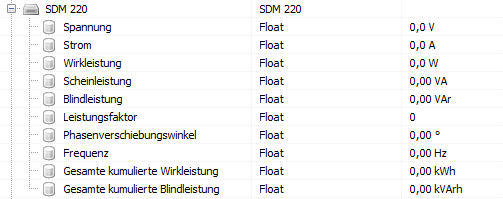

[](https://www.symcon.de/service/dokumentation/entwicklerbereich/sdk-tools/sdk-php/)
[]()
[](https://creativecommons.org/licenses/by-nc-sa/4.0/)  
[](https://www.symcon.de/forum/threads/30857-IP-Symcon-4-3-%28Stable%29-Changelog)

# SDM 220

## Dokumentation

**Inhaltsverzeichnis**

1. [Funktionsumfang](#1-funktionsumfang)  
2. [Voraussetzungen](#2-voraussetzungen)  
3. [Software-Installation](#3-software-installation) 
4. [Einrichten der Instanzen in IP-Symcon](#4-einrichten-der-instanzen-in-ip-symcon)
5. [Statusvariablen und Profile](#5-statusvariablen-und-profile)  
6. [PHP-Befehlsreferenz](#6-php-befehlsreferenz)   
7. [Anhang](#7-anhang)  
    1. [Changlog](#1-changlog)
    2. [Spenden](#2-spenden)
8. [Lizenz](#8-lizenz)

## 1. Funktionsumfang

Ermöglich die einfache Einbindung von Energie-Zählern des Typs SDM 220 der Firma B+G E-Tech. 
Zusätzlich können mehrere Zähler auf einem physikalischen RS485-Bus betrieben werden.  

## 2. Voraussetzungen

 - IPS 4.3 oder höher  
 - SDM 220 Zähler mit 'ModBus-Interface 
 - physikalisches RS485 Interface für die Zähler  

## 3. Software-Installation

Dieses Modul ist Bestandteil der IPSBGETEch-Library.

**IPS 4.3:**  
   Bei privater Nutzung: Über das 'Module-Control' in IPS folgende URL hinzufügen.  
    `git://github.com/Nall-chan/IPSBGETEch.git`  

   **Bei kommerzieller Nutzung (z.B. als Errichter oder Integrator) wenden Sie sich bitte an den Autor.**  

## 4. Einrichten der Instanzen in IP-Symcon

Das Modul ist im Dialog 'Instanz hinzufügen' unter dem Hersteller 'B+G E-Tech' zu finden.  
  

Es wird automatisch eine 'ModBus Gateway' als Splitter-Instanz, sowie ein 'Client Socket' als dessen I/O-Instanz erzeugt.  
Werden in dem sich öffnenden Konfigurationsformular muss der Abfrage-Zyklus eingestellt werden.  
Über den Button 'Gateway konfigurieren' oder das Zahnrad hinter der Übergeordneten Instanz wird das Konfigurationsformular des 'ModBus Gateway' geöffnet.  
Hier muss jetzt der Modus passend zur Hardwareanbindung (TCP /RTU) sowie die Geräte-ID des Zählers eingestellt und übernommen werden.  
Anschließend über den Button 'Schnittstelle konfigurieren' oder wieder über das Zahnrad hinter der Übergeordneten Instanz, das Konfigurationsformular der I/O-Instanz öffnen.  
Je nach Hardwareanbindung müssen hier die RS485 Parameter oder die IP-Adresse des ModBus-Umsetzers eingetragen werden.  
Details hierzu sind dem Handbuch des Zählers (RS485) und dem eventuell verwendeten Umsetzer zu entnehmen.  

## 5. Statusvariablen und Profile

Folgende Statusvariablen werden automatisch angelegt.  

| Name                                              | Typ   | Ident                                      | Profil       |
| :-----------------------------------------------: | :---: | :----------------------------------------: | :----------: |
| Spannung                                          | float | Voltage                                    | Volt.230     |
| Strom                                             | float | Current                                    | Ampere       |
| Wirkleistung                                      | float | Active power                               | Watt.14490   |
| Scheinleistung                                    | float | Apparent power                             | VA           |
| Blindleistung                                     | float | Reactive power                             | VaR          |
| Leistungsfaktor                                   | float | Power factor                               |              |
| Phasenverschiebungswinkel                         | float | Phase angle                                | PhaseAngle   |
| Frequenz                                          | float | Frequency                                  | Hertz.50     |
| Gesamte kumulierte Wirkleistung                   | float | Total active energy                        | Electricity  |
| Gesamte kumulierte Blindleistung                  | float | Total reactive energy                      | kVArh        |

Folgende Profile werden automatisch angelegt.  

| Name        | Typ   |
| :---------: | :---: |
| PhaseAngle  | float |
| VA          | float |
| VaR         | float |
| Intensity.F | float |
| kVArh       | float |

Darstellung in der Console.  
 
## 6. PHP-Befehlsreferenz

```php
bool SDM220_RequestRead(int $InstanzID);
```
Ließt alle Werte vom Zähler.  
Bei Erfolg wird `true` und im Fehlerfall wird `false` zurückgegeben und eine Warnung erzeugt.  


## 7. Anhang

### 1. Changlog

Version 2.0:  
 - DRS 458 ergänzt  
 - SDM 72D ergänzt  
 - SDM 120C ergänzt  
 - SDM 220 ergänzt  
 - SDM 230 ergänzt  
 - SDM 630 fehlende Werte ergänzt und kleiner Bugfixes  

Version 1.1:  
 - Profile ergänzt  
 - Doku ergänzt  

Version 1.0:  
 - Erstes offizielles Release  

### 2. Spenden  
  
  Die Library ist für die nicht kommzerielle Nutzung kostenlos, Schenkungen als Unterstützung für den Autor werden hier akzeptiert:  

<a href="https://www.paypal.com/cgi-bin/webscr?cmd=_s-xclick&hosted_button_id=G2SLW2MEMQZH2" target="_blank"></a>

## 8. Lizenz

  IPS-Modul:  
  [CC BY-NC-SA 4.0](https://creativecommons.org/licenses/by-nc-sa/4.0/)  
 
